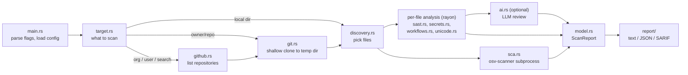

# How ghaudit works

This document follows one scan from the command line to the report, then explains the
main design decisions. File references are to `src/`.

## The pipeline



### 1. Command line (`main.rs`)

`clap` parses the arguments into a `Cli` struct. Configuration is built in three layers:

1. built-in defaults (`config.rs`);
2. an optional TOML file (`-c`); unknown keys are an error;
3. command-line flags.

Then:

- If `-o` is given, the output path is checked *before* scanning: a temporary file is
  created next to it and renamed into place at the end.
- The scan runs inside `tokio::select!` together with a Ctrl-C listener. Interrupting
  drops the scan, which deletes temporary clones and kills child processes.
- The exit code is computed last from the findings and the analyzer statuses. The
  table is in the README.

### 2. Target (`target.rs`)

`ghaudit scan X` accepts three kinds of `X`, checked in this order:

1. An existing directory.
2. A GitHub URL, including SSH remotes and deep links such as `.../tree/main/src`.
3. `owner/repo`.

Owner and repository names are validated against GitHub's character rules before they
are put into any URL. `org`, `user` and `search` build their targets directly.

### 3. Getting the code (`github.rs`, `git.rs`)

- **Listing repositories.** `github.rs` is a small REST client (reqwest) with
  pagination. Rate-limit errors are turned into a readable message with the reset
  time. Forks and archived repositories are skipped unless asked for.
- **Cloning.** `git.rs` runs the system `git`: `clone --depth 1 --single-branch
  --no-tags` into a `TempDir`, which is deleted when it goes out of scope. The token is
  passed as an HTTP header through `GIT_CONFIG_*` environment variables, so it never
  appears in `ps` output or in `.git/config`. `core.symlinks=false` makes symlinks in a
  hostile repository plain files.
- **Multi-repo scans.** These run `github.concurrency` repositories at a time
  (`futures::buffered`). A repository that fails to clone is recorded in the report
  with its error instead of aborting the run.

### 4. Choosing files (`discovery.rs`)

This step uses the `ignore` crate, the same walker as ripgrep:

- `.gitignore` is honored even outside a git checkout.
- Directories such as `node_modules`, `vendor`, `target`, `dist` and `.venv` are pruned
  by name at any depth.
- Hidden files are included, so `.env` gets checked.
- Symlinks are never followed.
- Files over `max_file_size` are dropped.

`read_text` treats a file with NUL bytes near the start as binary (this also catches
UTF-16) and replaces invalid UTF-8 rather than failing.

### 5. Analysis (`scanner.rs` and `analyzer/`)

`Scanner::scan_dir` runs two things concurrently:

- **Per-file analysis** on a rayon thread pool. Each file is read once and given to the
  SAST engine (if its language has rules) and the secret detector (unless it is a
  lockfile or minified). Suppression comments are applied here, and any secret found
  in a file is masked in every snippet from that file.
- **osv-scanner** as a subprocess, which walks the same tree for lockfiles.

The optional LLM review runs after that, one file at a time.

Each analyzer reports an `AnalyzerStatus`: `completed`, `skipped` or `failed`. A
failure is never turned into "no findings". The report, the text output and the SARIF
`executionSuccessful` flag all show it, and the exit code becomes 3.

#### SAST engine (`analyzer/sast.rs`, `analyzer/rules/`)

Each rule is a [tree-sitter query](https://tree-sitter.github.io/tree-sitter/using-parsers/queries/)
plus metadata (`rules/mod.rs::Rule`). For example, Python's "subprocess with
shell=True":

```scheme
(call
  function: (attribute object: (identifier) @mod attribute: (identifier) @fn)
  arguments: (argument_list
    . [(identifier) (attribute) (call) (subscript) (binary_operator) (string (interpolation))]
    (keyword_argument name: (identifier) @k value: (true)))
  (#eq? @mod "subprocess")
  (#match? @fn "^(run|call|check_call|check_output|Popen)$")
  (#eq? @k "shell")) @finding
```

The query matches syntax, not text. In plain terms it says: a call to
`subprocess.run` (or `call`, `Popen`, ...) whose first argument is not a fixed string
and which passes `shell=True`. Comments and strings can't match it.

The engine works like this:

- Queries are compiled once per grammar when the engine is built.
- Parsers are cached per thread.
- JavaScript rules also run on the TypeScript and TSX grammars.
- `requires` is an optional regex the whole file must match first. Go's math/rand rule
  uses it to check the import.
- Every rule carries `examples` and `counter_examples`, and
  `every_rule_matches_its_examples_and_not_its_counter_examples` runs all of them. A
  rule that stops matching, or starts over-matching, fails the build.

#### GitHub Actions workflows (`analyzer/workflows.rs`)

Each `.github/workflows/*.yml` file is parsed with `serde_yaml_ng`. The checks then run
over the structure:

1. `on:` is collected as a set of triggers. `on:` may be a string, a list or a map.
2. Each job and its steps are walked in order.
3. The checks combine the trigger set with what a step does.

Some examples of how the checks combine:

- `${{ github.event.issue.title }}` inside `run:` is always injection. It is
  **critical** when the trigger is privileged (`pull_request_target`, `issue_comment`,
  `workflow_run`, ...), because the job then holds secrets and a write token.
- `actions/checkout` with `ref: ${{ github.event.pull_request.head.sha }}` is only a
  problem on `pull_request_target`/`workflow_run`. On `pull_request` it is the safe,
  normal pattern, so it is not flagged.

The list of attacker-controlled contexts (`ATTACKER_CONTEXT`) follows GitHub's
security-hardening guidance and zizmor's context analysis. Excluded are values an
outsider cannot shape freely: numbers, SHAs, repository names.

Line numbers are found by searching the source text forward from the previous match,
so repeated text resolves to the occurrence being checked.

#### Hidden Unicode (`analyzer/unicode.rs`)

This runs on source files and on AI-agent instruction files. It looks for:

- bidirectional controls (U+202A–202E, U+2066–2069);
- Unicode tag characters (U+E0000–E007F);
- zero-width characters, in agent files only.

Flag emoji (which legitimately use tag characters), a leading byte-order mark, and
zero-width joiners in emoji are allowed. The snippet shows each hidden character as
`<U+XXXX>`.

#### Secrets (`analyzer/secrets.rs`)

There are two passes:

1. **Provider patterns.** Regexes for token formats with a recognizable shape
   (`ghp_` + 36 characters, `AKIA` + 16, PEM key blocks with key material, ...).
2. **Generic assignments.** A value assigned to a secret-like name. This pass is
   filtered against:
   - placeholders (`changeme`, `<...>`, `xxxx`);
   - references (`${VAR}`, `process.env`);
   - names that only contain the word (`token_url`, `max_tokens`);
   - values that look like identifiers;
   - test, example and doc paths.

Values are masked as the first four characters plus `********`; the mask doesn't reveal
the length. Fingerprints are computed from the masked line, never from the secret, so
a published fingerprint can't be used to brute-force a weak password.

#### Dependencies (`analyzer/sca.rs`)

ghaudit runs:

```bash
osv-scanner scan source --recursive --all-packages --allow-no-lockfiles --format json <root>
```

It then turns each advisory **group** into a finding. osv-scanner groups advisories that
are aliases of each other, such as a GHSA and a PYSEC entry for the same CVE. For each
group:

- **Severity** comes from the group's `max_severity`, a CVSS base score osv-scanner
  computes. If that is empty, it falls back to the GHSA rating in `database_specific`,
  and failing that it is `unknown`. Unknown is treated as medium for thresholds, so it
  is never filtered out as noise.
- **Fixed versions** are the `fixed` events of the advisory's ranges that are newer than
  the installed version.
- **Location** is the lockfile path relative to the scan root, plus a best-effort line
  number for the package.

Exit codes 0 and 1 from osv-scanner both mean success. Anything else, a missing binary,
a timeout or unparsable output is a failed analyzer. Error lines on stderr (for example
a manifest it could not resolve) are kept as warnings on the analyzer status.

### 6. The report (`model.rs`, `report/`)

`ScanReport` holds:

- the findings;
- per-analyzer statuses;
- per-repository summaries (for multi-repo scans);
- stats.

`finalize()` drops findings below `min_severity`, makes fingerprints unique, sorts the
findings (by severity, then repository, path and line) and recomputes the counts in
one place.

A finding's `fingerprint` hashes the rule, the path and the *content* of the line, not
its number. Adding a line above a finding doesn't change its identity, which is what
SARIF consumers need to track alerts across runs.

The three formats:

- **text**: grouped and colored. Colors are stripped automatically when stdout is not a
  terminal, via `anstream`.
- **json**: the `ScanReport` serialized as is. Field names are stable.
- **sarif**: SARIF 2.1.0 with:
  - one rule per rule ID (one per advisory for dependencies);
  - `security-severity` scores;
  - CWE tags;
  - `partialFingerprints`;
  - tool execution notifications for failed analyzers.

  CI validates it against the official schema.

## Design decisions

| Decision | Why |
|---|---|
| Workflow checks are static and per file | They need no API calls, so they cost nothing extra in org-scale scans. That is ghaudit's niche next to deeper single-repo tools like zizmor. |
| ghaudit's own CI pins every action by SHA, and releases use no caches | It follows its own advice: see `.github/workflows/`. Release binaries carry signed build provenance. |
| Delegate dependency scanning to osv-scanner | Lockfile parsing and per-ecosystem version matching are large, subtle problems that Google maintains well. The old hand-written version mis-parsed versions and lost all severities. |
| Small, precise rule set | A scanner that flags every `unwrap()` or file read gets ignored. Every rule must ship with examples and near-misses. |
| System `git` and pure-Rust TLS (rustls + ring) | No C libraries to build, so `cargo install` works on Windows, macOS and Linux. Proxies and credentials behave like the user's own git. |
| Failures are loud | A security tool that turns "couldn't check" into "nothing found" is worse than no tool. |
| Logs on stderr, reports on stdout | Reports can be piped and redirected safely. |
| Strict config | Unknown keys are errors, so a misspelled setting can't silently do nothing. |

## Testing

| Layer | Where | What |
|---|---|---|
| Unit | `#[cfg(test)]` in each module | parsing, filtering, severity mapping, redaction, path handling |
| Rules | `analyzer/sast.rs` | every rule's examples and counter-examples, on every grammar it targets |
| osv-scanner | `analyzer/sca.rs` | conversion of recorded real osv-scanner output (`tests/fixtures/osv-scanner/`), plus fake binaries for the error paths |
| GitHub API | `github.rs` | pagination and errors against an in-process mock HTTP server |
| End to end | `tests/cli.rs` | the real binary: exit codes, formats, exclusions, redaction, SARIF stability |
| Live | `tests/cli.rs` (ignored by default) | the real osv-scanner; run in CI with `--include-ignored` |
