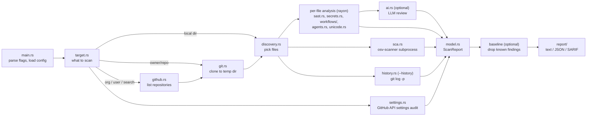

# How ghaudit works

This document follows one scan from the command line to the report, then explains the
main design decisions. File references are to `src/`.

## The pipeline



### 1. Command line (`main.rs`)

`clap` parses the arguments into a `Cli` struct. Configuration is built in three layers:

1. built-in defaults (`config.rs`);
2. an optional TOML file (`-c`); unknown keys are an error;
3. command-line flags.

Then:

- If `-o` is given, the output path is checked *before* scanning: a temporary file is
  created next to it and renamed into place at the end.
- The scan runs inside `tokio::select!` together with a Ctrl-C and SIGTERM listener.
  Interrupting drops the scan future, which deletes temporary clones, kills child
  processes and tells analysis threads to stop.
- With `--baseline FILE`, the earlier JSON report is read before the scan (a bad path
  fails fast). After the scan, `ScanReport::apply_baseline` drops every finding whose
  repository and fingerprint are in it, and counts them.
- The exit code is computed last from the findings and the analyzer statuses. The
  table is in the README.

### 2. Target (`target.rs`)

`ghaudit scan X` accepts three kinds of `X`, checked in this order:

1. An existing directory.
2. A GitHub URL, including SSH remotes and deep links such as `.../tree/main/src`.
3. `owner/repo`.

Owner and repository names are validated against GitHub's character rules before they
are put into any URL. A URL must be on the configured GitHub host (github.com, or the
GitHub Enterprise host of `github.api_url`): `gitlab.com/a/b` is an error, not a scan of
`github.com/a/b`. `org`, `user` and `search` build their targets directly.

### 3. Getting the code (`github.rs`, `git.rs`)

- **Listing repositories.** `github.rs` is a small REST client (reqwest) with
  pagination. Rate-limit errors are turned into a readable message with the reset
  time. Forks and archived repositories are skipped unless asked for. `user` targets
  use `/users/{name}/repos`, which lists public repositories only, unless the token
  belongs to that user: then `/user/repos?affiliation=owner` adds the private ones.
- **Cloning.** `git.rs` runs the system `git`: `clone --depth 1 --single-branch
  --no-tags` (with `--history`, `clone --no-tags`: every branch, every commit) into a
  `TempDir`, which is deleted when it goes out of scope. The token is
  passed as an HTTP header through `GIT_CONFIG_*` environment variables, so it never
  appears in `ps` output or in `.git/config`, and only for http(s) URLs. The repository
  is untrusted, so the clone runs nothing it controls: `core.symlinks=false` makes
  symlinks plain files, `protocol.ext.allow=never` disables the `ext::` transport, and
  the LFS filter is disabled (`filter.lfs.*`, `GIT_LFS_SKIP_SMUDGE`) so the repository's
  `.lfsconfig` cannot send git-lfs to a server of its choosing. Clone errors are cut to
  git's one `fatal:` line.
- **Multi-repo scans.** These run `github.concurrency` repositories at a time
  (`buffer_unordered`, so one slow repository does not stall the others; the original
  order is restored afterwards). Each repository, clone included, has
  `github.repo_timeout_secs`. A repository that fails or times out is recorded in the
  report with its error instead of aborting the run, and a progress line per repository
  goes to stderr.

### 4. Choosing files (`discovery.rs`)

This step uses the `ignore` crate, the same walker as ripgrep:

- `.gitignore`/`.ignore` files are honored only when the tree is trusted (by default, a
  local directory; see `config::TrustRepo`). In a repository you are auditing they are
  the author's way of hiding files.
- Even then, files git tracks are added back when an ignore rule matches them
  (`git ls-files --cached --ignored`), because they are in the repository all the same.
  Every git command ghaudit runs passes `-c core.fsmonitor=false`, so a `.git/config`
  copied in with a downloaded project cannot make it run a command.
- Directories such as `node_modules`, `vendor`, `target`, `dist` and `.venv` are pruned
  by name at any depth.
- Hidden files are included, so `.env` gets checked.
- Symlinks are never followed.
- Files over `max_file_size` are not read, and are listed in the report's `skipped`.

`read_file` decodes UTF-16 (with a byte-order mark, or recognized by its zero bytes, as
git's `working-tree-encoding` writes it) and replaces invalid UTF-8 rather than failing.
Other files with NUL bytes are binary: they still go through the credential patterns,
since a NUL byte in front of a secret does not make it harmless.

### 5. Analysis (`scanner.rs` and `analyzer/`)

`Scanner::scan_dir` runs these concurrently:

- **Per-file analysis** on a rayon thread pool. Each file is read once and given to the
  secret detector (unless it is a lockfile or minified), the SAST engine (if its
  language has rules and the file is not minified), the hidden-Unicode check, the
  workflow audit and the agent-config audit. A shared cancellation flag stops the
  threads when the scan is dropped.
- **osv-scanner** as a subprocess, which walks the same tree for lockfiles.
- **The history search** (`--history`), on a blocking thread with the same flag.

Next to `scan_dir`, and concurrently with it, the **settings audit** reads the
repository's settings from the GitHub API (for a local directory, the repository its
`origin` remote names). Organization scans also audit the organization itself.

The optional LLM review runs after that, one file at a time, on a copy of the file with
detected credentials replaced by `********`.

Every file's findings then go through `scanner::finish`:

1. Findings in tests, examples and docs become `info` (secrets have their own policy).
2. Every secret value found in the file is masked in all snippets and messages, with
   one Aho-Corasick pass (`secrets::Masker`), and findings on a line holding a secret
   get a fingerprint of the line with the value replaced by `********`.
3. `ghaudit:ignore` comments are applied, in trusted trees only, and counted.
4. One rule keeps at most 25 findings per file; the rest are counted in `omitted`.
5. Snippet lines are cut to 200 characters around the finding.

These steps are linear in the file's size: lines are looked up through a
`model::LineIndex` built once per file, never by rescanning the text.

Each analyzer reports an `AnalyzerStatus`: `completed`, `skipped` or `failed`. A
failure is never turned into "no findings". The report, the text output and the SARIF
`executionSuccessful` flag all show it, and the exit code becomes 3.

#### SAST engine (`analyzer/sast.rs`, `analyzer/rules/`)

Each rule is a [tree-sitter query](https://tree-sitter.github.io/tree-sitter/using-parsers/queries/)
plus metadata (`rules/mod.rs::Rule`). For example, Python's "subprocess with
shell=True":

```scheme
(call
  function: [(identifier) @fn (attribute attribute: (identifier) @fn)]
  arguments: (argument_list
    . [(identifier) (attribute) (call) (subscript) (binary_operator) (string (interpolation))]
    (keyword_argument name: (identifier) @k value: (true)))
  (#match? @fn "^(run|call|check_call|check_output|Popen)$")
  (#eq? @k "shell")) @finding
```

The query matches syntax, not text. In plain terms it says: a call to `run` (or
`call`, `Popen`, ...), as `subprocess.run` or imported bare, whose first argument is not
a fixed string and which passes `shell=True`. Comments and strings can't match it.

A rule can follow one step of data flow. Its `bindings` query marks variables assigned
a dangerous value (capture `@var`), and its main query can require `(#bound? @arg)`:

```scheme
; bindings: a variable assigned SQL built from strings
(assignment left: (identifier) @var right: (string (interpolation)) @q
  (#match? @q "(?i)\\b(select|insert|update|delete)\\b"))

; main query: that variable passed to execute()
(call function: (attribute attribute: (identifier) @m)
      arguments: (argument_list . (identifier) @arg)
  (#match? @m "^(execute|executemany)$")
  (#bound? @arg)) @finding
```

tree-sitter hands `#bound?` back to the engine as a "general predicate". The engine
evaluates it: the argument must name a variable bound earlier in the same function (the
nearest enclosing function node, per grammar).

The engine works like this:

- Queries are compiled once per grammar when the engine is built.
- Parsers are cached per thread.
- JavaScript rules also run on the TypeScript and TSX grammars.
- `requires` is an optional regex the whole file must match first. Go's math/rand rule
  uses it to check the import.
- Parsing and querying share a 5-second budget per file, enforced through tree-sitter's
  progress callbacks. A file that hits it is listed in `skipped`. Deeply nested input
  can otherwise make tree-sitter very slow.
- Columns are converted from tree-sitter's byte offsets to characters.
- Every rule carries `examples` and `counter_examples`, and
  `every_rule_matches_its_examples_and_not_its_counter_examples` runs all of them. A
  rule that stops matching, or starts over-matching, fails the build.

#### GitHub Actions workflows (`analyzer/workflows/`)

Workflow files (`.github/workflows/*.yml`) and composite actions (`action.yml`) are
parsed by `workflows/yaml.rs`, a small tree builder over saphyr-parser's event stream.
It keeps the position of every node, so findings point at the exact line. It is also
hardened for hostile input: anchored nodes are shared rather than copied when an alias
refers to them, and a document whose logical size exceeds 100,000 nodes (an "alias
bomb") is refused with a `gha/unanalyzable-workflow` finding. The parser itself rejects
pathological nesting.

The checks then run over the structure:

1. `on:` is collected as a set of triggers. `on:` may be a string, a list or a map.
2. Each job and its steps are walked in order, carrying the `env:` variables in scope.
3. The checks combine the trigger set with what a step does.

Some examples of how the checks combine:

- `${{ github.event.issue.title }}` inside `run:` is always injection. It is
  **critical** when the trigger is privileged (`pull_request_target`, `issue_comment`,
  `workflow_run`, ...), because the job then holds secrets and a write token.
- `actions/checkout` with `ref: ${{ github.event.pull_request.head.sha }}` is only a
  problem on `pull_request_target`/`workflow_run`. On `pull_request` it is the safe,
  normal pattern, so it is not flagged.

`${{ }}` expressions are parsed by `workflows/expr.rs` into a small syntax tree, then
checked for taint:

- Context access in any spelling (`GitHub.Event['issue'].title`) is normalized.
- Comparisons and `!` yield booleans, and `contains()`/`startsWith()` too, so they are
  never tainted. `a && b` can yield `b`, and `a || b` either side.
- `toJSON(github.event.pull_request)` serializes an object that contains attacker
  fields; `format()` and `join()` pass their arguments through.
- `env.X` is tainted when `X` was defined from an attacker field in an enclosing
  `env:`. `inputs.*` is tainted, at low severity, in reusable workflows and composite
  actions.

The list of attacker-controlled fields (`expr::ATTACKER_FIELDS`) follows GitHub's
security-hardening guidance and zizmor's context analysis. Excluded are values an
outsider cannot shape freely: numbers, SHAs, repository names.

An expression inside a `run:` block is located by searching the scalar's own source
text, so repeated expressions resolve to their own lines.

#### Hidden Unicode (`analyzer/unicode.rs`)

This runs on source and configuration files and on AI-agent instruction files. It looks
for:

- bidirectional controls (U+202A–202E, U+2066–2069);
- Unicode tag characters (U+E0000–E007F);
- zero-width characters, invisible operators, Hangul fillers and blank-looking
  characters;
- direction marks (LRM, RLM, ALM) next to ASCII code;
- variation selectors that select nothing, which can encode a hidden payload.

Legitimate uses are allowed: subdivision flags (which use tag characters), a leading
byte-order mark, emoji sequences, joiners and marks after letters of scripts that need
them, and typography in translation catalogs. The snippet shows each hidden character
as `<U+XXXX>`.

#### Secrets (`analyzer/secrets.rs`)

There are two passes:

1. **Provider patterns.** Regexes for token formats with a recognizable shape
   (`ghp_` + 36 characters, `AKIA` + 16, PEM key blocks with key material, ...). A
   match must not continue into a longer token. They run on binary files too, and in
   tests and docs they are capped at medium severity.
2. **Generic assignments.** A value assigned to a secret-like name. This pass is
   filtered against:
   - placeholders (`changeme`, `<...>`, `xxxx`);
   - references (`${VAR}`, `process.env`);
   - names that only contain the word (`token_url`, `max_tokens`);
   - values that look like identifiers;
   - test, example and doc paths.

Values are masked as the first four characters plus `********`; the mask doesn't reveal
the length. Fingerprints of every finding on a line holding a secret, whatever its
rule, are computed from the line with each secret value replaced by `********`. So a
published fingerprint can't be used to brute-force a weak password.

Credentials are matched by value, not just by line: placeholders include counting and
keyboard runs (`12345`, `abcdef`, `a1b2c3`, `qwerty`), which test fixtures are full of
and random tokens practically never contain.

#### Git history (`analyzer/history.rs`)

`git log --all -p -U0` is streamed line by line, with a marker line per commit. Each
`+++ b/path` header selects a file (deletions, excluded directories, `--exclude`
patterns and lockfiles are skipped), `@@` headers give line numbers, and the added
lines of one commit to one file are collected and run through the secret detector as
one text. Findings are mapped back to their line in that version of the file, masked
like any other, and deduplicated by value: git lists the newest commit first, so each
credential is reported once, at the newest commit that added it.

Values the scan of the current files found are then dropped (`drop_current`), so a
credential is reported in history only when it is gone from the files. A history
finding carries `commit`, and its fingerprint includes the commit, so a baseline that
accepts one leak cannot hide another on a similar line.

The repository is not trusted to configure git: `--no-ext-diff`, `--no-textconv`,
`--no-show-signature` and `log.showSignature=false` keep diff drivers, textconv filters
and `gpg.program` from running, and `--src-prefix`/`--dst-prefix`, `--no-renames`,
`--no-color` and `core.quotePath=false` pin the output format. Limits: 1 GiB of diff,
10 minutes, and 2 MiB of added text per file version; hitting one marks the result
incomplete in the analyzer status. A shallow clone is reported as partial history.

#### Agent and editor configs (`analyzer/agents.rs`)

Files are recognized by name and parent directory (`.mcp.json`, `.claude/settings.json`,
`.vscode/tasks.json`, `.codex/config.toml`, ...), parsed as JSON (comments and trailing
commas stripped first) or TOML, and walked by tool:

- MCP server definitions (`mcpServers`, VS Code's `servers`, Zed's `context_servers`,
  Codex's `[mcp_servers.*]`): the command line is checked for download-and-run
  patterns; `npx`/`uvx`/`pipx run`/`pnpm dlx`/`bunx`/`docker run` are checked for a
  pinned version or digest; remote URLs for plain HTTP to a non-local host; `trust: true`.
- Claude Code: hooks and command settings (`apiKeyHelper`, `statusLine`, ...),
  `enableAllProjectMcpServers`, `Bash` allowed outright, `bypassPermissions`.
- VS Code: `chat.tools.autoApprove` and tasks that run on `folderOpen`.
- Codex `approval_policy`/`sandbox_mode`, Gemini `autoAccept`.

Every command any of these runs goes through one download-and-execute regex first
(`curl ... | sh`, `iex`, `base64 -d | sh`, `/dev/tcp`, `nc -e`, `powershell -enc`).

#### Settings (`analyzer/settings.rs`)

Each check reads one or more endpoints through `GitHub::probe`, which returns the status
code and body instead of failing on 4xx. Rate limits and server errors are still errors.
Every check ends as pass, fail or not assessable, and the rules for that are strict:

- A 404 means "turned off" only when the repository's own `permissions.admin` says the
  token is an admin's; otherwise GitHub hides settings behind 404 and the check is not
  assessable.
- 403s (missing token scopes or fine-grained permissions) are not assessable, with
  GitHub's message as the detail.
- `security_and_analysis` absent from the repository object is not assessable. For a
  non-admin token that means it cannot see it; for an admin it means GitHub does not
  offer secret scanning there (a user-owned private repository without GitHub Secret
  Protection), and the detail says so, since no extra permission would help.
- 403 "Upgrade to GitHub Pro" is not a permission problem: the feature does not exist
  on the plan. For branch protection that is still a failure (the branch *is*
  unprotected), weighted medium and with a fix that names the plan.

Branch protection is judged from `GET /repos/{o}/{r}/rules/branches/{branch}`, which
includes organization rulesets, and classic protection. When the rules cannot be read
for any other reason and classic protection is off, the branch checks are not
assessable rather than failed, since unreadable rulesets may still protect it. Probes
for one repository run concurrently (`tokio::join!`). A failure becomes a finding with
category `settings`, a synthetic location (the settings page path), and `help_url`, the
page that fixes it. Archived repositories skip the branch, Actions, Dependabot and
private vulnerability reporting checks: their settings are read-only, Dependabot does
not scan them, and GitHub refuses vulnerability reporting for them.

#### Dependencies (`analyzer/sca.rs`)

ghaudit runs:

```bash
osv-scanner scan source --recursive --all-packages --allow-no-lockfiles --format json <root>
```

It then turns each advisory **group** into a finding. osv-scanner groups advisories that
are aliases of each other, such as a GHSA and a PYSEC entry for the same CVE. For each
group:

- **Severity** comes from the group's `max_severity`, a CVSS base score osv-scanner
  computes. If that is empty, it falls back to the GHSA rating in `database_specific`,
  and failing that it is `unknown`. Unknown is treated as medium for thresholds, so it
  is never filtered out as noise.
- **Informational RustSec advisories** carry `informational` in each affected entry's
  `database_specific`, and the finding's `dependency.informational` repeats it. They are
  labeled in the title and message instead of "is affected by". An unrated
  `unmaintained` advisory is `low`: it reports no flaw, cargo-audit only warns about it,
  and GitHub's advisory database does not republish it. `unsound` advisories keep their
  rating, or stay `unknown`: they are memory-safety bugs, and where GitHub reviewers
  rate them the ratings run from low to high.
- **Fixed versions** are the `fixed` events of the advisory's ranges that are newer than
  the installed version.
- **Location** is the lockfile path relative to the scan root, plus a best-effort line
  number for the package.
- **Requirements files** list ranges, not installed versions. For a package a
  `requirements*.txt` (or `.in`) file does not pin with `==`, osv-scanner resolves a
  version itself, so the finding says so and its confidence is medium.

When the tree is untrusted, ghaudit adds `--config <empty file> --no-ignore`: a
`--config` file replaces every per-directory `osv-scanner.toml` (which can ignore
packages and advisories), and `--no-ignore` stops `.gitignore` from hiding lockfiles.

Exit codes 0 and 1 from osv-scanner both mean success. Anything else, a missing binary,
a timeout or unparsable output is a failed analyzer. Error lines on stderr (for example
a manifest it could not resolve) are kept as warnings on the analyzer status.

### 6. The report (`model.rs`, `report/`)

`ScanReport` holds:

- the findings;
- per-analyzer statuses;
- per-repository summaries (for multi-repo scans);
- `skipped`: files that were not fully analyzed, and why;
- `omitted`: counts of findings beyond the per-rule, per-file limit;
- `settings`: every settings check with its outcome (pass, fail, not assessable);
- stats, including suppressed, skipped, omitted and baselined counts.

`finalize()` drops findings below `min_severity`, makes fingerprints unique, sorts the
findings (by severity, then repository, path and line) and recomputes the counts in
one place.

A finding's `fingerprint` hashes the rule, the path and the *content* of the line, not
its number. Adding a line above a finding doesn't change its identity, which is what
SARIF consumers need to track alerts across runs.

The three formats:

- **text**: grouped and colored. Colors are stripped automatically when stdout is not a
  terminal, via `anstream`. Every string that comes from the scanned code (paths,
  snippets, messages, error output) passes through `report::terminal_safe`, which shows
  control and invisible characters as `<U+XXXX>`.
- **json**: the `ScanReport` serialized as is. Field names are stable.
- **sarif**: SARIF 2.1.0 with:
  - one rule per rule ID (one per advisory for dependencies);
  - `security-severity` scores;
  - CWE tags;
  - `partialFingerprints`;
  - `columnKind: unicodeCodePoints`, matching ghaudit's character columns;
  - percent-encoded artifact URIs;
  - tool execution notifications for failed analyzers, skipped files and omitted
    findings;
  - settings findings with the "no file associated with this alert" location
    (Scorecard's convention) and the settings page as `helpUri`; history findings with
    their `commit` in `properties`.

  CI validates it against the official schema.

## Design decisions

| Decision | Why |
|---|---|
| Workflow checks are static and per file | They need no API calls, so they cost nothing extra in org-scale scans. That is ghaudit's niche next to deeper single-repo tools like zizmor. |
| ghaudit's own CI pins every action by SHA, and releases use no caches | It follows its own advice: see `.github/workflows/`. Release binaries carry signed build provenance. |
| Delegate dependency scanning to osv-scanner | Lockfile parsing and per-ecosystem version matching are large, subtle problems that Google maintains well. The old hand-written version mis-parsed versions and lost all severities. |
| Small, precise rule set | A scanner that flags every `unwrap()` or file read gets ignored. Every rule must ship with examples and near-misses. |
| System `git` and pure-Rust TLS (rustls + ring) | No C libraries to build, so `cargo install` works on Windows, macOS and Linux. Proxies and credentials behave like the user's own git. |
| Failures are loud | A security tool that turns "couldn't check" into "nothing found" is worse than no tool. The settings audit's "not assessable" is the same rule applied per check. |
| History is opt-in | A full clone and a walk of every commit cost far more than a depth-1 scan; for repositories you own it is where deleted credentials still live. |
| Cloned repositories are untrusted | Their ignore files, suppression comments and osv-scanner config are written by the party being audited. |
| Every per-file step is linear and budgeted | One crafted file must not stall an org-wide scan or exhaust memory. |
| Logs on stderr, reports on stdout | Reports can be piped and redirected safely. |
| Strict config | Unknown keys are errors, so a misspelled setting can't silently do nothing. |

## Testing

| Layer | Where | What |
|---|---|---|
| Unit | `#[cfg(test)]` in each module | parsing, filtering, severity mapping, redaction, path handling |
| Rules | `analyzer/sast.rs` | every rule's examples and counter-examples, on every grammar it targets |
| osv-scanner | `analyzer/sca.rs` | conversion of recorded real osv-scanner output (`tests/fixtures/osv-scanner/`), plus fake binaries for the error paths |
| GitHub API | `github.rs` | pagination and errors against an in-process mock HTTP server |
| Settings | `analyzer/settings.rs` | each check's pass, fail and not-assessable outcomes from canned API responses |
| Git history | `analyzer/history.rs` | real repositories built in a temp dir: deleted, renamed and still-present credentials, limits |
| End to end | `tests/cli.rs` | the real binary: exit codes, formats, exclusions, redaction, SARIF stability, untrusted clones, org scans and settings audits against a mock API, baselines, history |
| Live | `tests/cli.rs` (ignored by default) | the real osv-scanner; run in CI with `--include-ignored` |
